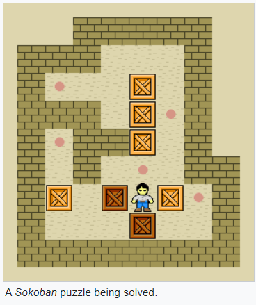
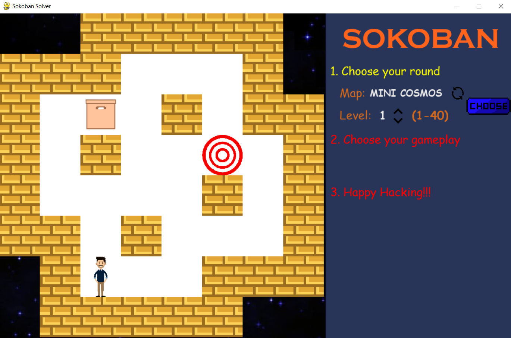
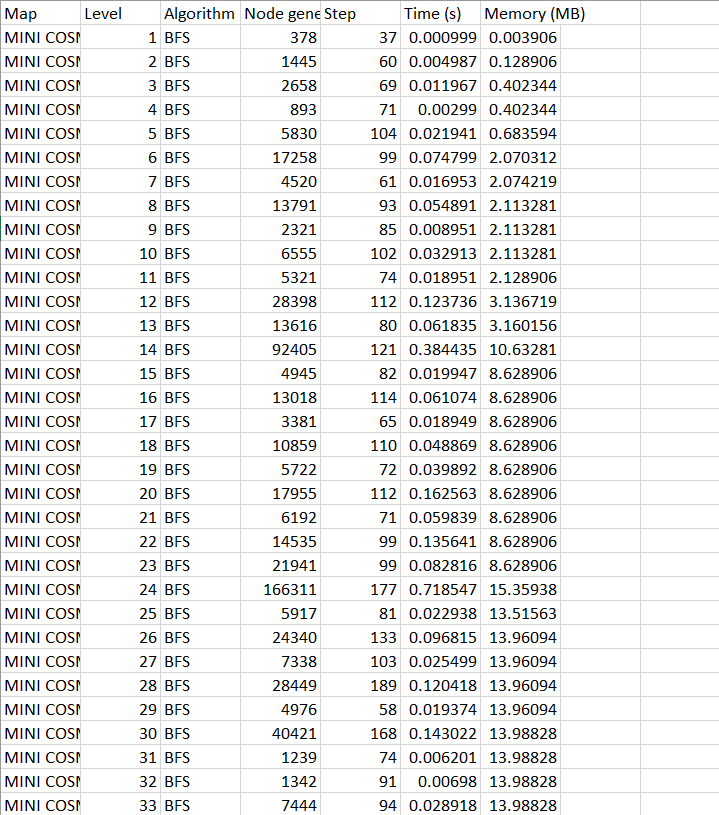
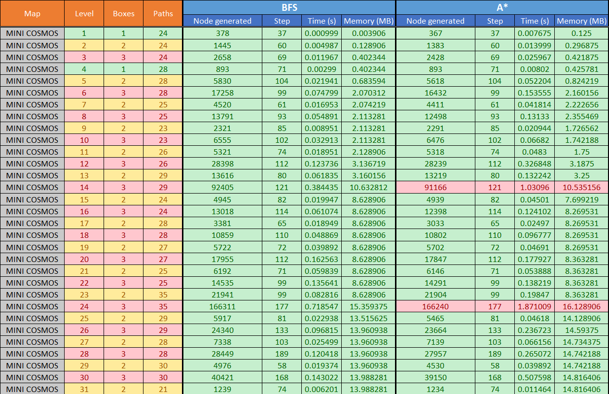
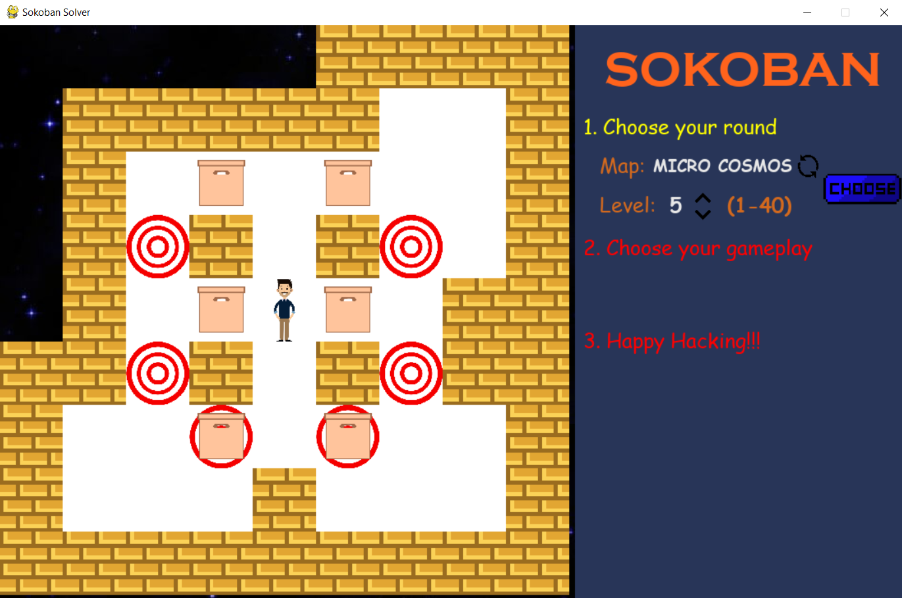
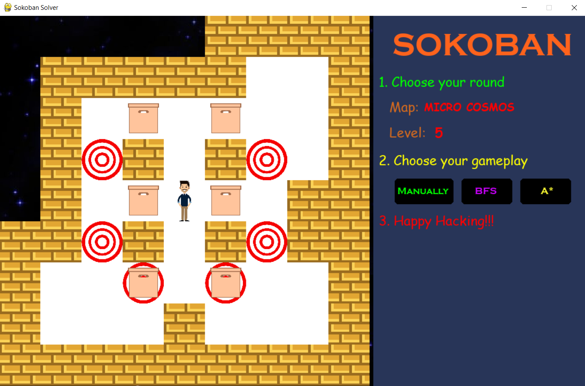
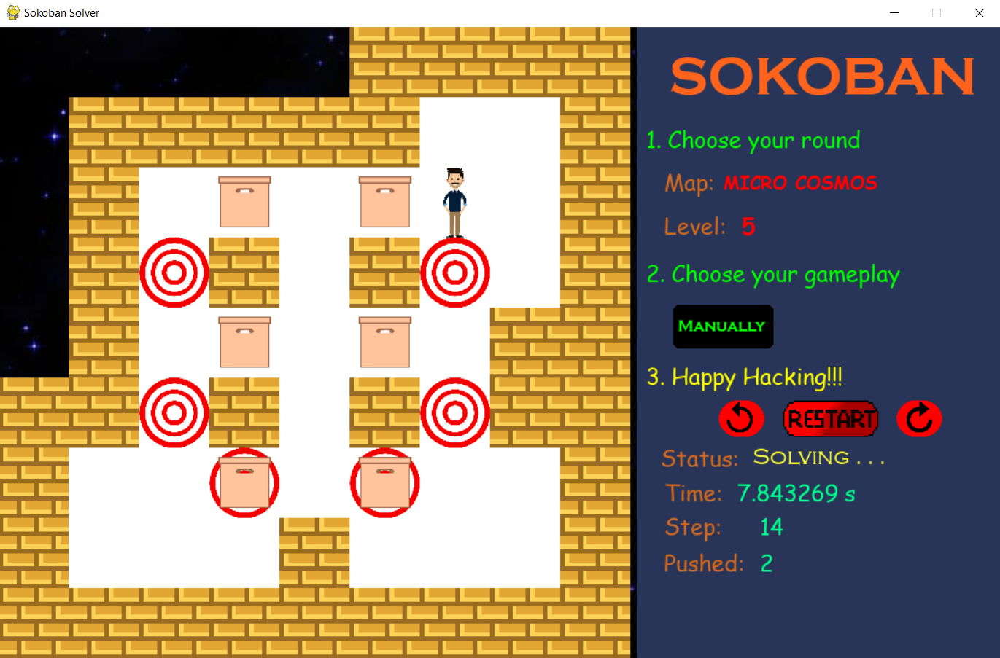
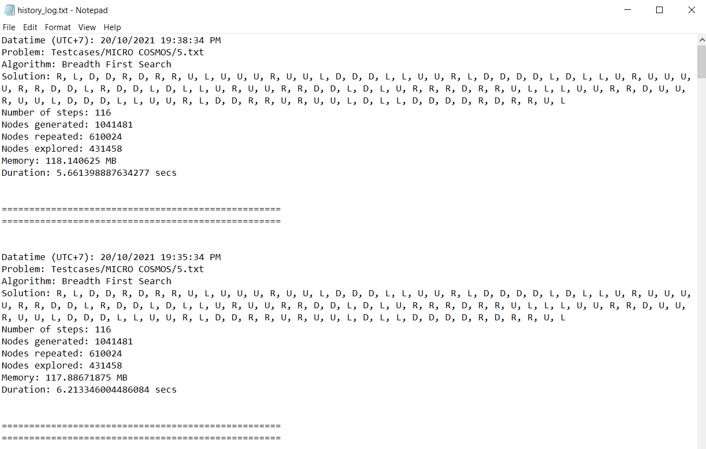
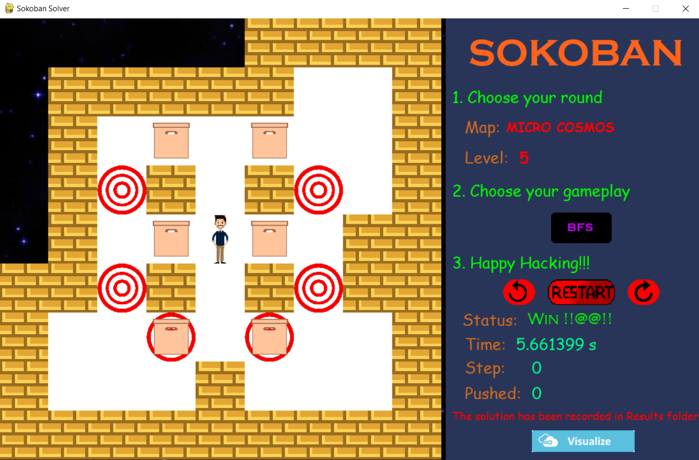
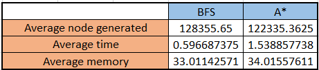

# Sokoban game
**Assignment 1 - Introduction to Artificial Intelligence**  
This project is aimed to create a `Sokoban` game that we can play manually or automatically using *searching algorithm*. We use two searching algorithms here, the first is 'BFS' for blind search and 'A*' for heuristic search. Our team selects `Pygame` to create the UI of this game. In this project, we are going to play and solve the Sokoban game in 80 maps including 40 testcases in `Micro Cosmos` and 40 testcases in `Mini Cosmos` (source: [link](https://ksokoban.online/)). All problems and tasks we can see in `assignment1.pdf` file (Vietnamese language).

## Introduction of Sokoban
Sokoban is a puzzle video game genre in which the player pushes crates or boxes around in a warehouse, trying to get them to some goal locations.The game is played on a board of squares, where each square is a floor or a wall. Some floor squares contain boxes, and some floor squares are marked as goal locations.

The player is confined to the board and may move horizontally or vertically onto empty squares (never through walls or boxes). The player can move a box by walking up to it and push it to the square in front. Boxes cannot be pulled, and they cannot be pushed to squares with walls or other boxes. The number of boxes equals the number of storage locations. The puzzle is solved when all boxes are placed at storage locations.   
<div align="center">

</div> 
**Refs:** https://en.wikipedia.org/wiki/Sokoban


## Authors 
**Quach Minh Tuan - To Thanh Phong - Vo Anh Nguyen**

## Version
1.0.0

## Requirements
+ `Python` >= 3.9.7
+ `Pip` >= 21.2.3
  

## Installation
Clone our source code
```sh
$ git clone https://github.com/nh0znoisung/Sokoban
$ cd Sokoban
```

Install Dependencies
```sh
$ pip install -r requirements.txt
```

Run program

```sh
$ python main.py
```

## Testing
For `Breadth First Search` algorithm testing result
```sh
$ python test_BFS.py
```
For `A star` algorithm testing result
```sh
$ python test_Astar.py
```
Before running these command above, we need to delete the `BFS.csv` and `A_star` file. Because it will firstly loading the number of testcase that we solved in the last visit in order to the case that we don't need to run all testcases from scratch.
<div align="center">

</div> 


The statistic we use for analyzing is stored in `BFS_auth.csv` and `A_star_auth.csv` file. This result recorded when run on *`Windows 10, CPU Intel Core i5 8250U - 8th generation, RAM 16Gb, SSD 240Gb`* and all are gathering and editing in `all_test.xlsx`

## Drawing charts
```sh
$ python statistic.py
```

## How to use?
### Step 1
Firstly, we need to suitable map that we want to solve. You can click the up or down arrow to choose level between 1 and 40 or clicking the change button to toogle between Mini Cosmos and Macro Cosmos.  When change occurs, the new map is displayed in the left side.
*Note:* The map and the level is not sorted by the difficulty. Some adjance map may just have some same things in the map and deffrent in the position of boxes or goals or player.

### Step 2
Choose your game play. In this step, we have only 3 options including `Manually` that we can self-play and control the player with 4 directions (Up, Left, Right, Down); `BFS` and `A*` for running algorithm automatically.


### Step 3
In the process of moving in self-playing, we can undo and redo or restart a new game. We can control the player in 4-direction by some instructions below:
+ Click `Up arrow` or `W` to go **up**.
+ Click `Down arrow` or `S` to go **down**.
+ Click `Left arrow` or `A` to go **left**.
+ Click `Right arrow` or `D` to go **right**.

The move is available if it satisfies some rules including:  
+ The forward cell is not the wall.
+ If the forward cell is a box, we consider the forward of the forward cell. If that is not a box or a wall, we can move forward and simultaneously push the box to forward cell.



After solving by user or algorithm, the program will automatically save the winning state of the game in `Results` folder. To be more specific, this folder has 2 important part including `history_log.txt` file which stores generally all history of all testcases and some text files that represent for history of the single testcase, for example `Solution_MICRO COSMOS_test 7.txt`. These file are sorted by time in descending order and contain some crucial infomations such as datetime, problem, algorithm, solution, the number of steps, the number of nodes generated, memory, duration,...


By solving the testcase by algorithm, we have `Visualize button` to simulate the player with the solution that found before.

## Work Flow
1. At first, we need to generate these testcases. In this link [link](https://ksokoban.online/), we convert 80 maps into 80 text files manually with some notation. For example, player is @, wall is #, box is x, goal is ?,...  
<div align="center">

</div> 
2. Next, we create UI with pygame including board display game and the menu in the right-hand side with some button, mode and information about game.
3. We choose available data structure. For example, walls and goals is the list of positions and usually searching through list, so we choose set because it is designed as hash map so searching operator with O(1). Apart from it, boxes have fixed length and used to store state and insert to queue or priority queue so we use tuple since it is hashable.
4. We design the algorithm, we use the idea in this [link](https://baldur.iti.kit.edu/theses/SokobanPortfolio.pdf) in order to custom the cost of heuristic function by using more concept distanceToGoal array (Find the minimum length of paths from a goal to go to particular squares in the board. Note that this is the possible path so that we can push the box from this position to that goal with this length instead of physical distance such as Matthan or Euler), Dead squares (The cells that we put the box at this position, we can not go to any goals) and Maching algorithm - Hungarian algorithm (Find the minimum cost when matching each box to each goal. It basically cost time complexity O(n!) but it will reduce to O(n^3) when using Hungarian algorithm) 
5. Run 80 testcases with 2 algorithm (BFS,A*) and write its results to csv file. It took only about 1 minute to run all tests. With these data, we analysis and draw charts about it. 
6. Make slide on Canvas and export to PowerPoint.
7. Video screening.


## Our final results
+ Video (Vietnamese language): https://www.youtube.com/watch?v=oT5ag8KVyHA
+ Slide for presentation (Vietnamese language): `slide.pdf`

## Evaluation
BFS is more effective compare to A* in this problem. To be more specific:
+ About the running time, A* algorithm is slower than `3 times` compare with BFS. The reason is the algorithm inside when we implement. Firstly, A* needs to calculate the cost whenever it creates a new node. This stage uses `Hungarian algorithm` for matching the distance between the boxes and the goals and finding the minimum sum of this cost and it wastes `O(n^3)` while BFS doesn't need to store this value. Moreover, the data structure that we use for storing the list of nodes that is sorted in order of its cost is `min-heap (priority-queue)`. Every operation such as insert delete will cost us `O(log(n))` while node in BFS will be stored in a basic list and these operations just cost us `O(1)`.
+ About the space, the average node generated in A* algorithm is just `bigger little bit` compare with that of BFS algorithm. Since BFS will scan nodes in the whole current level until finding the final state or go to the next level and repeat it while A* will choose the node that has the minimum cost and go toward that node and expand more nodes in child level and continue to compare the cost and choose the next node until finding the final state so it's not restricted we must scan all node in a level. Therefore, A* algorithm just combines BFS and DFS and reduces more node generated and space when running.

In general, the solver will run exceed `1 second` when the map has the number of boxes and goals more than 4 and the space is large that we need to analyze more space of state.
<div align="center">

</div>

## Future project
+ This current map is restricted with 80 testcases. We can extend it more map in the collection of game in this [link](https://ksokoban.online/) such as `pico cosmos`, `nabo cosmos`,` DH1 collection`,.... We can totally do this by using crawling data map and position of another items with Selenium tool. There are apporximately 1000-2000 maps in this Web.
+ We can extend more algorithm such as UCS, DFS, Best first search, Hill Climbing,...


## References
### For UI
+ https://ksokoban.online/
### For algorithms
+ https://baldur.iti.kit.edu/theses/SokobanPortfolio.pdf
### For data structures and ideas
+  https://verificationglasses.wordpress.com/2021/01/17/a-star-sokoban-planning/
+ https://github.com/cynrd/blog/blob/master/sokoban_astar/main.py
+ https://github.com/janecakemaster/sokoban

